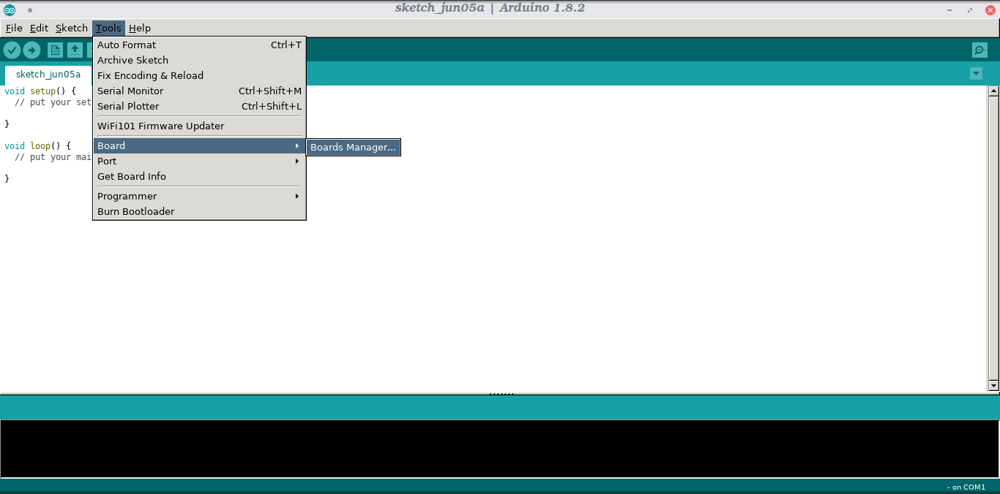
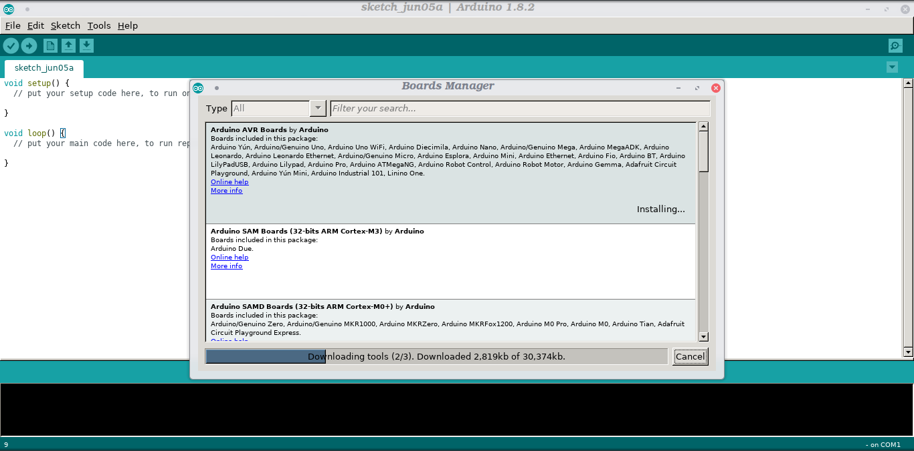
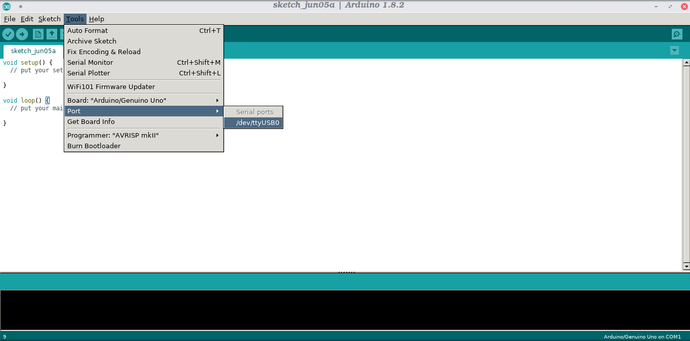
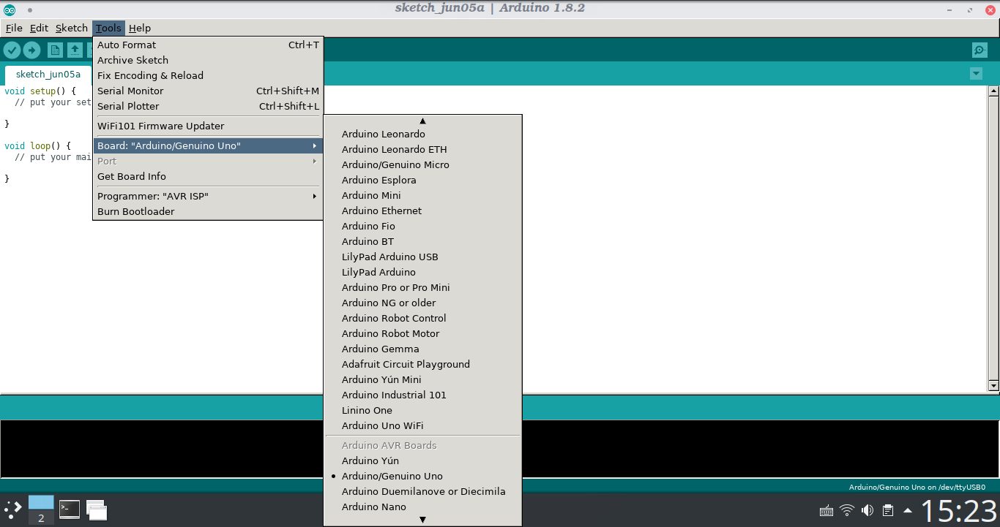
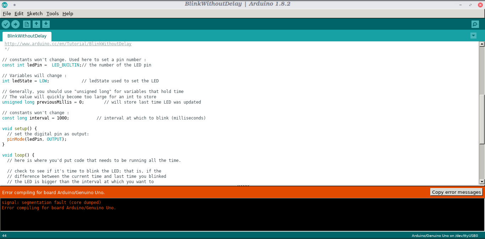

# CH341SER driver

1. [About driver](#about-driver)  
2. [Required dependencies](#required-dependencies)
3. [Changes](#changes)  
4. [Tests](#tests)  
5. [Installation](#installation)  
6. [Official website](#official-website)  
7. [Tutorial on Arch Linux](#tutorial-on-arch-linux)  
8. [Compatibility](#compatibility)  
9. [Fixing Problems](#fixing-problems)

<br/>
<br/>

## About driver

It's a manufacturer software of standard serial to usb chip marked CH340

<br/>
<br/>

## Required dependencies

- linux-headers

if you are using a different kernel, remember to install the headers for it, because the above package is for the standard linux kernel
<br/>

When using SecureBoot, you need to sign module. You can follow [this instruction](https://ubuntu.com/blog/how-to-sign-things-for-secure-boot)<br/>
Otherwise `make load `can fail
<br/>
<br/>

## Changes

Added line  
`#include <linux/sched/signal.h>`  
<br/>
which helps to fix the problem below:  
`error: implicit declaration of function ‘signal_pending’; did you mean ‘timer_pending’? [-Werror=implicit-function-declaration]`

and changed line:
<br/>
`wait_queue_t wait;`
<br/>
to
<br/>
`wait_queue_entry_t wait;`
<br/>
which helps to fix next problem below:
<br/>
`error: unknown type name ‘wait_queue_t’; did you mean ‘wait_event’?`

<br/>

merged pull request #17 (sirlucjan) and e-mail from zenon.ingielewicz@gmail.com fixed:  
```
error: initialization from incompatible pointer type [-Werror=incompatible-pointer-types]
```  
<br/>


Thanks to hesaputra - #10  

<br/>
<br/>
Additionally first pull request helped to merge changes for version 1.5 released in 2018-03-18:
[https://github.com/juliagoda/CH341SER/pull/1](https://github.com/juliagoda/CH341SER/pull/1)

<br/>
<br/>

## Tests

Tested on:
* Arch Linux 4.11.3-1-hardened
* Arch Linux 4.11.3-1-ARCH
* Linux Mint 19.3 Cinnamon
* Ubuntu 18.04.5 LTS
* ubuntu 22.04
* CentOS Linux release 8.3.2011

<br/>
<br/>

## Installation

See original readme.txt

<br/>
<br/>

## Official website

[http://www.wch.cn/download/CH341SER_LINUX_ZIP.html](http://www.wch.cn/download/CH341SER_LINUX_ZIP.html)

<br/>
<br/>

## Tutorial on Arch Linux

Tested for Arduino UNO R3 Clone  
<br/>


install required packages:  
`sudo pacman -S arduino arduino-docs avr-binutils avr-gcc avr-libc avrdude`

<br/>

if your system detects the package below:  
`pacman -Qs arduino-avr-core`

<br/>

you should remove it:  
`sudo pacman -R arduino-avr-core`

<br/>

we add current user to uucp and lock groups:  
```
gpasswd -a $USER uucp
gpasswd -a $USER lock
```
<br/>

it's possible, that you have to load that module:  
`modprobe cdc_acm`

<br/>

clone fixed driver:  
`git clone https://github.com/juliagoda/CH341SER.git`

<br/>

according to the original readme.txt, we use the commands below:  
```
make
sudo make load
```
<br/>

to be sure, that module will be loaded after reboot, you can change file extension from "*.ko" to "*.ko.gz" and add it to drivers path:  
```
find . -name *.ko | xargs gzip
sudo cp ch34x.ko.gz /usr/lib/modules/$(uname -r)/kernel/drivers/usb/serial
```
<br/>

if the command:  
`lsmod | grep ch341` 

<br/>

shows some result (but it doesn't have to), then:  
```
sudo rmmod ch341
sudo mv /usr/lib/modules/$(uname -r)/kernel/drivers/usb/serial/ch341.ko.gz /lib/modules/$(uname -r)/kernel/drivers/usb/serial/ch341.ko.gz~
```

`sudo depmod -a`

<br/>

let's connect Arduino UNO R3 Clone to USB input and check our results:  
`dmesg | grep ch34x`

<br/>

that's example of my command's output:  
```
[  492.836159] ch34x 3-1:1.0: ch34x converter detected
[  492.846265] usb 3-1: ch34x converter now attached to ttyUSB0
```

<br/>

so our driver ch34x was successfully loaded and our port's name is ttyUSB0  
<br/>
Let's start our installed Arduino IDE.  
<br/>
First we should install package for Arduino AVR Boards from Boards Manager:  

<br/>



<br/>



<br/>

And now we must choose our port's name. My port's name is ttyUSB0.  

<br/>



<br/>
<br/>
<br/>

#### Why we wanted arduino-avr-core package from official repo to be removed? Let's check it out.  

`sudo pacman -S arduino-avr-core`

<br/>

and let's reopen our Arduino IDE and check out boards list.  

<br/>



<br/>

New label "Arch Linux Arduino AVR Boards" with boards has been added to boards list. It has the same options, so let's choose "Arduino/Genuino Uno" from a new part and upload our code to Arduino UNO R3 Clone.

<br/>


<br/>



<br/>

It didn't work. I think, that the package was created for original arduino boards, which are not compatible with their clones. If you want to have installed the package and work on clone of Arduino, better choose the same option from part labeled "Arduino AVR Boards".

<br/>
<br/>

## Compatibility

This driver is not compatible with the Olimex ESP32-POE rev C board

## Fixing Problems

if the dmesg command does not indicate ttyUSB, only:

```
[ 457.050482] usbserial: USB Serial support registered for ch34x
1279.608531] ch34x 3-2:1.0: ch34x converter detected
```

then:
1) some dependencies are missing (are not installed)
2) at this stage the Arduino was connected not only to USB, but also to a prepared breadboard (you have to unplug cables connecting Arduino to breadboard)
3) kernel hearders are missing (are not installed)
4) It may happen, that kernel doesn't contain CONFIG_USB_SERIAL_CH341 flag, but you need it or it is disabled. You have to check configs of the kernel you are using
